

  

This website can be found at: 
[https://manoafitnessfinder.meteorapp.com](https://manoafitnessfinder.meteorapp.com)

 
The repository for this website can be found at: 
[https://github.com/manoafitnessfinder](https://github.com/manoafitnessfinder)

## Table of contents

* [Description](#description)
* [Team Members](#team-members)
* [User Guide](#user-guide)
* [Milestone 1](#milestone-1)
* [Milestone 2](#milestone-2)
* [Milestone 3](#milestone-3)
* [Coming Soon](#coming-soon)

## Overview

The problem: The freshman fifteen! Students who have to worry about going to the gym alone or going on a run by themselves lose the motivation to get fit.

The solution: Manoa Fitness Finder! Our app allows students to log in and create a profile. For their profile, they provide user information including age, gender, photo, and a short blurb about themselves. Next, users are prompted to provide information to facilitate matching them to the perfect fitness buddy. This includes interests (e.g. Running, Lifting, Calisthentics, Hiking), level (e.g. beginner, intermediate, advanced), seeking (e.g. gym buddy, mentor, mentee), and goals (e.g. run an 8 minute mile, squat 200 lbs). The app uses this information to pair users to others with similar information by way of a matching feature.

The user first creates a profile with their user information and matching information. From there, they can create/edit events via a schedule page. They can also browse other users and add them to their friend list.

Advanced implementation might include the ability to document meetups for either safety or progress tracking, upload photos for completed outings, and view a feed of events based on the current user's friend list.

For privacy and safety, we will provide a warning for users to meet matched users in a public place.

## Team Members

### Patrick McCrindle

I'm currently a Junior at UH Manoa studying Security Science. Having had no prior expierence with website design this class has been a whirlwind of new information. My interests for the this project is learning to implement basic website security and refining my knowledge of software engineering.

### Lucy Rock

I'm currently a Junior at UH Manoa, studying to get my BS in Computer Science. I am excited for this assignment because I have always had an interest in web design, and I can't wait to apply what I've learned in this class so far.

### Sophia Rathyen

I'm a junior at UH Manoa double majoring in Computer Science and Russian. I have a passion for graphic design and art and hope to make use of some of those skills while designing this site. Along the way, I also hope to become adept in using Meteor and MongoDB. I'm looking forward to merging my interest in fitness and software engineering to create a useful, beneficial website for other students.

### Nathan Anderson

Website design is my passion. Growing up on my father's Javascript farm gave me a lifelong love of creating websites and an appreciation of the development skills required. It's become my dream to create the best Meteor app React designed intellij developed website for finding fitness partners in the Manoa area.

### Christine Uehara

I'm currently a Junior at UH Manoa, studying to get my BS in Computer Science. I have some experience in designing websites using a website developer, nothing like what we are learning in class. I am excited to take what I learned while working on this project and apply it to the website I am currently designing for work. 

## Galaxy Deployment

View our current website at <a href="http://manoafitnessfinder.meteorapp.com/#/">Manoa Fitness Finder</a>.

## User Guide

### Landing Page 
[http://manoafitnessfinder.meteorapp.com/#/](http://manoafitnessfinder.meteorapp.com/#/) 
This is the first page a new user will see before creating a profile. 

### Testimonials Page
[http://manoafitnessfinder.meteorapp.com/#/test](http://manoafitnessfinder.meteorapp.com/#/test) 
This page will contain user-submitted reviews to attract new users.

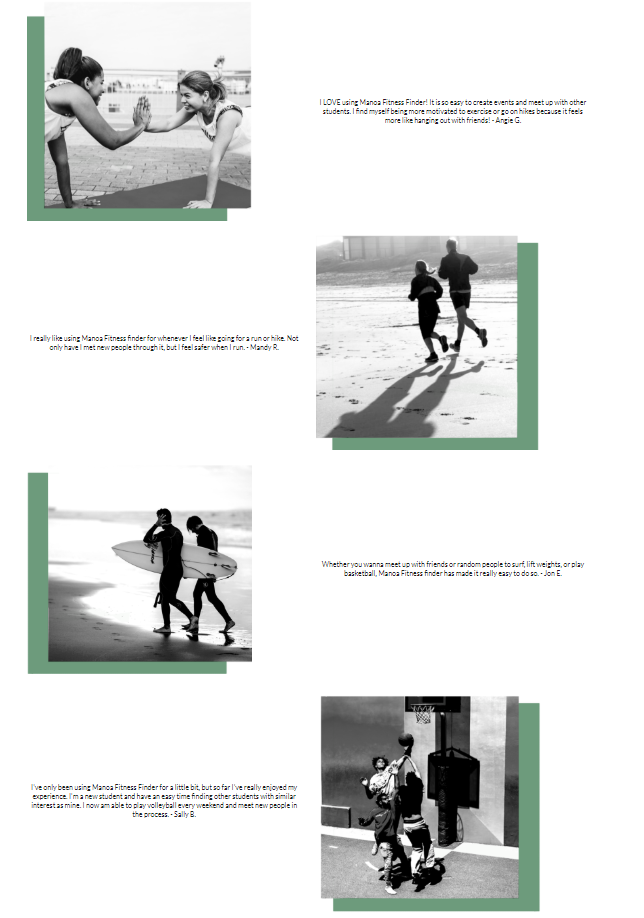

### About Page
[http://manoafitnessfinder.meteorapp.com/#/about](http://manoafitnessfinder.meteorapp.com/#/about) 
This page provides information about Manoa Fitness Finder in short, easy to read blurbs. It's meant for prospective users who are confused or curious about how the site works. 

### Contact Page
[http://manoafitnessfinder.meteorapp.com/#/contact](http://manoafitnessfinder.meteorapp.com/#/contact) 
This allows users who are having issues to contact the development team to help resolve them.

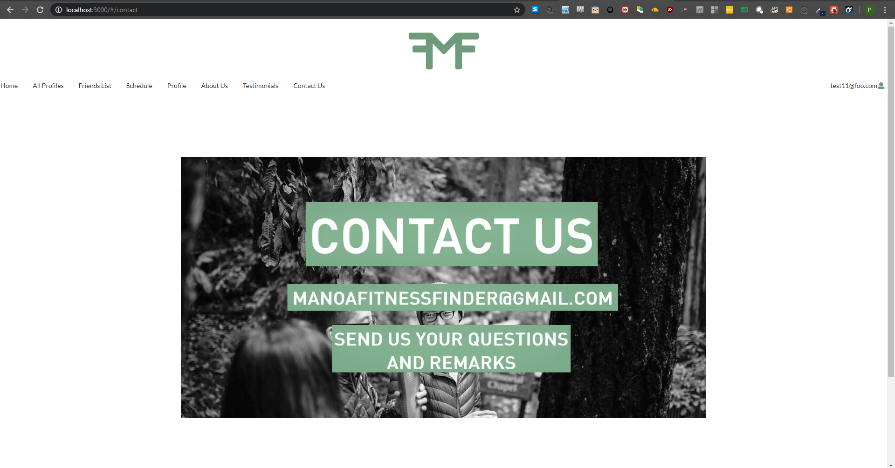

### Login Page
[http://manoafitnessfinder.meteorapp.com/#/signin](http://manoafitnessfinder.meteorapp.com/#/signin) 
All links that contain "login" lead here. Much of the site's functionality (e.g. matching, scheduling) is hidden until a user is logged in.

### Sign Up Page
[http://manoafitnessfinder.meteorapp.com/#/signup](http://manoafitnessfinder.meteorapp.com/#/signup) 
This page allows new users to create accounts on Manoa Fitness Finder. Once the user has filled out the user information on this page, they are directed to the Edit Profile page, where they can edit their user information and fill in their matching information.

### Edit Profile Page
Once a user has signed up, they are directed to this page, where they can edit the information that displays on their profile, including information used for matching. Due to the url for this page containing a mongoDB Id, it's url won't be included.

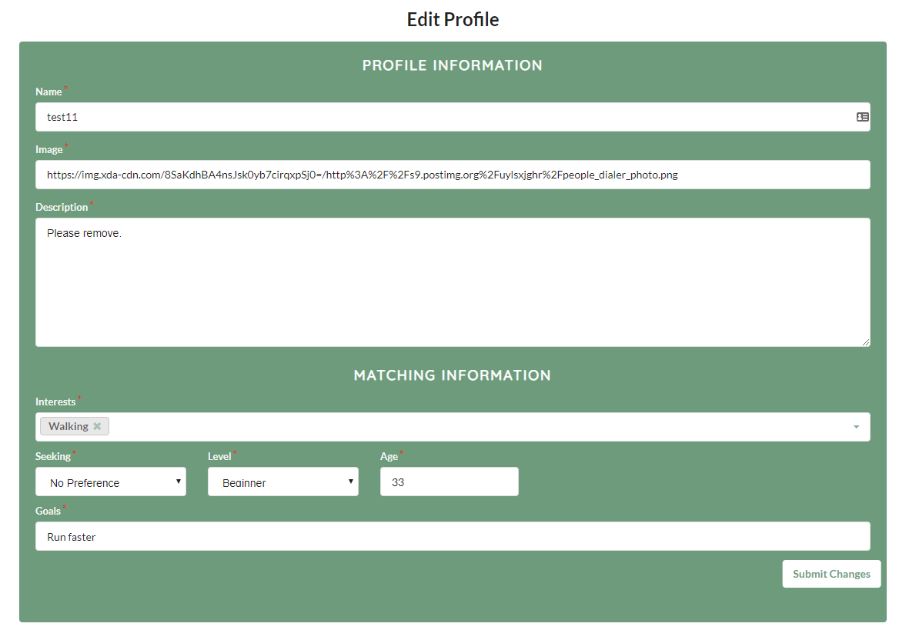

### User Profile Page
[http://manoafitnessfinder.meteorapp.com/#/profile](http://manoafitnessfinder.meteorapp.com/#/profile) 
This page displays the current user's user profile information (name, age, gender, blurb, image) as well as their matching information (interests, seeking, level, goals). It displays the information as another user would view it. On the top right, it contains a link to the Edit Profile page.

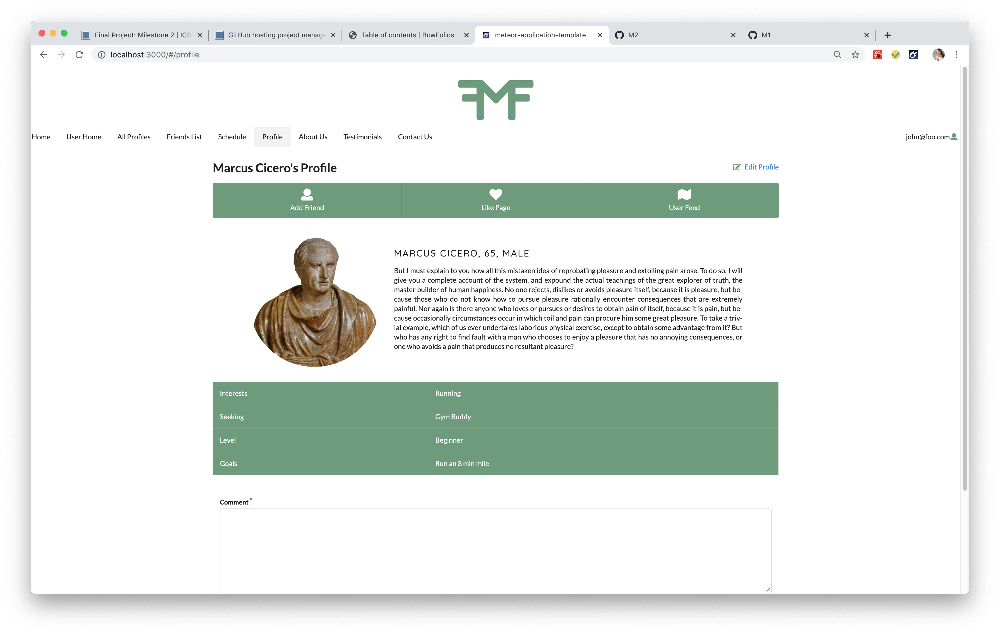

### User Landing Page
[http://manoafitnessfinder.meteorapp.com/#/landing](http://manoafitnessfinder.meteorapp.com/#/landing) 
Once a user has logged in, they can view this landing/home page. It shows more relevant information, including events scheduled by users on the logged in user's friend list.

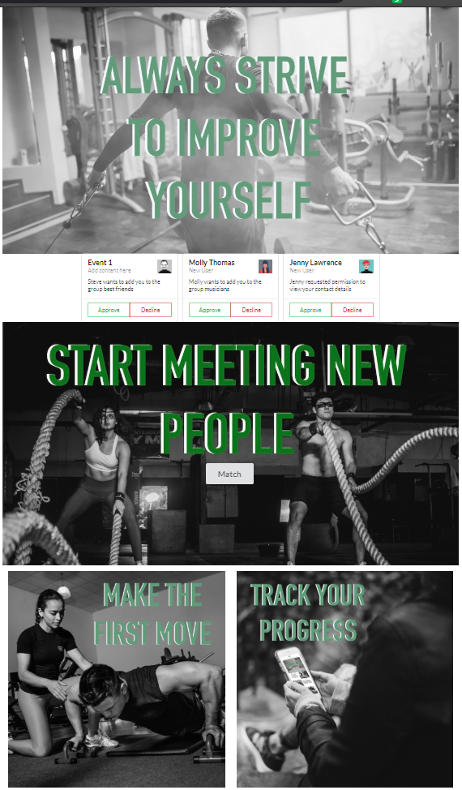

### All Users Page
[http://manoafitnessfinder.meteorapp.com/#/AllProfiles](http://manoafitnessfinder.meteorapp.com/#/AllProfiles) 
This page lists all users on the site. It will contain a filter element that allows the logged in user to search through the list via both user profile information (age, gender) and matching information (interest, level, seeking).

### Schedule Page
[http://manoafitnessfinder.meteorapp.com/#/schedule](http://manoafitnessfinder.meteorapp.com/#/schedule) 
This page lists all events owned (created) by the current user. An event can be created using the left sidebar; upcoming events are those which are later or equal to today's current minute. All other events are filtered into the past events section, which contains grayed cards. Events in the upcoming section are filtered in ascending order while those in the past section are sorted in descending order. Each event is editable via the link on the bottom right of the card, which takes the user to the Edit Event page.

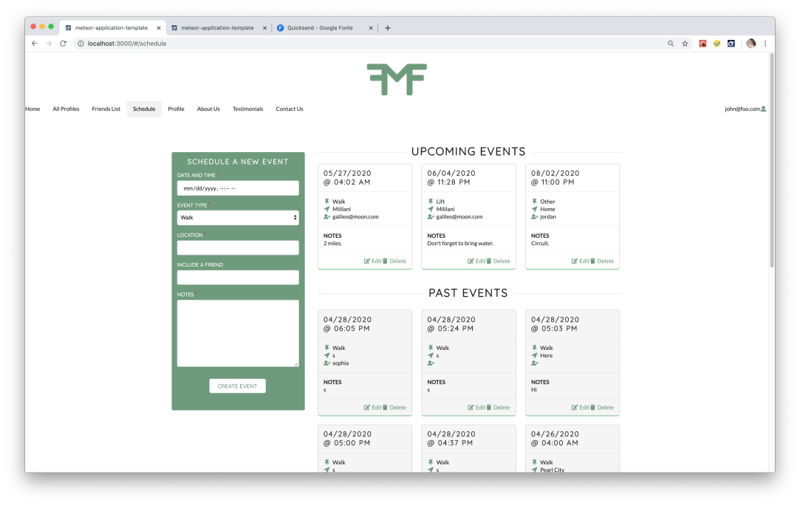

### Edit Event Page
This page allows the logged in user to edit events belonging to them. M3 implementation will allow users to choose other users from their friend list for the 'Include a Friend' field. Due to the url for this page containing a mongoDB Id, it's url won't be included.

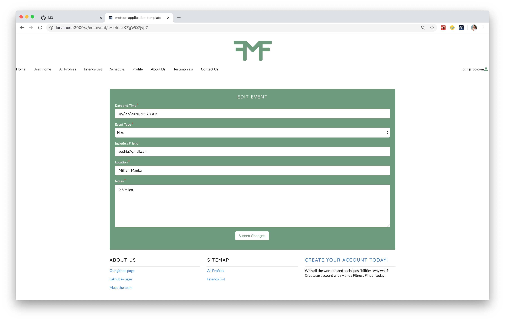

### Other Profiles Page
This is the page to view another user's profile. The edit user link (for other users than oneself) will be disabled in M3. Due to the url for this page containing a mongoDB Id, it's url won't be included.

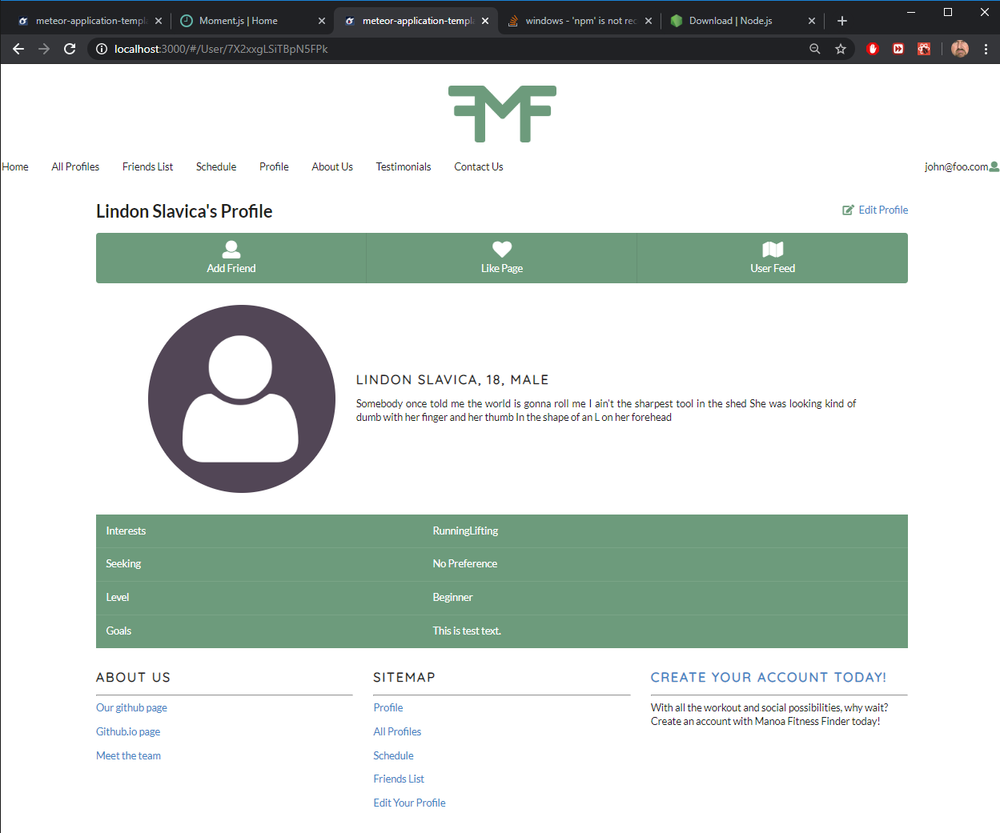

### Friends Page
[http://manoafitnessfinder.meteorapp.com/#/friends](http://manoafitnessfinder.meteorapp.com/#/friends) 
This page lists all the logged in user's added friends. Each friend card is clickable and directs to that person's profile.

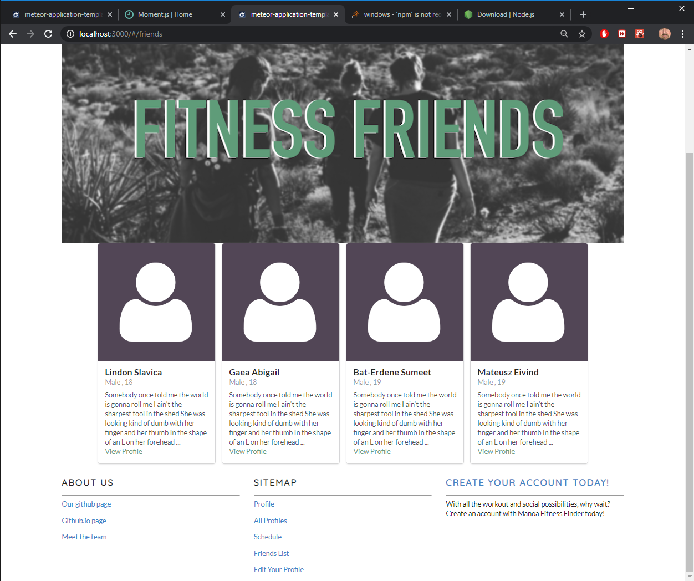

## Community Feedback

For our user feedback we ended up getting detailed feedback from 8 different people, 5 of which are in the UH community. Their responses are listed below in general categories:

### The Good

Users liked that the site was responsive, ie if you make an event or comment you get an alert saying that it was added successfully. They liked that they could record past events as a way to "log" things they had already done. The site overall was praised for being not cluttered yet still having enough information that the users did not feel lost. Users said that the site felt organized. Users liked that their home page included a list of their upcoming events. Users liked that signing up was simple and straight forward.

### The Bad (and fixed)

Some of the errors brought up by the users were implemented with varying degrees of difficulty. For example, some users were puzzled about the terms and conditions (they were removed). An undefined field was on their profile, this was the gender that they were unable to edit (is accessible in the edit profile page). Upon submission the edit profile page doesn't redirect you back the profile page (fixed it now does this). Notes on the events had an error where it would spill behind other cards(now only displays the first 25 characters). The comments left by a user are hard to track down who left them (the users name is now a link to their profile). Comment box on my own profile (this was removed and was an artifact of digits). Users did not like being the first page that they visit being their edit profile (the first page now displayed after sign up is the user landing page). Not enough interests to their liking (the included list has been updated with more interests).

### The Bad

Users wanted messaging system between users. We did not enough time to or know how to implement this. A filter on the all profiles page. Our issues with this project were mostly mongoDB based and this seemed like a doable but very difficult request. Additionally, with only a few users it is not to much of a hassle at the moment. Having both people agree to a friendship, this was certainly doable but we ran out of time to implement it. 

## Developer Guide

First you will need install <a href = "https://www.meteor.com/install">Meteor</a>. Second you will need to install <a href = "https://nodejs.org/en/download/">Node.js</a>. 

Third go to the our <a href = "https://github.com/manoafitnessfinder/app">github</a> and download it as a template. Fourth copy it to your local machine by clicking "Clone or Download". 

Now cd into the app directory of the local your local copy and perform:

`
$ meteor npm install
`

Followed by:

`
$ npm install moment --save
`

With that all out of the way launch the application with the included start script:

`
$ meteor npm run start
`

Now you have a local instance running. You can modify the code as you want. 

For error checking you can use the following command to search the whole application for errors:

`
$ meteor npm run lint
`

Feel free to email us with issues you may be having at <a href = "mailto:manoafitnessfinder@gmail.com">manoafitnessfinder@gmail.com</a>.

## Milestone 1: Basic page and layout development
Our goal for this milestone was to create a set of rough pages that would provide users with basic functionality before moving on to more complex things. We focused on simple pages including the Sign Up, Log In, Landing, and User Profile Pages. We also began to work on the layout of the site by creating a Nav Bar, Footer, and Logo.

Milestone 1 was managed using <a href="https://github.com/manoafitnessfinder/app/projects/1">ManoaFitnessFinder GitHub Project Board M1</a>:

## Milestone 2: Data model development and layout improvement
For this milestone, we focused on site functionality which relied on a more complex data model. We implemented the All Profiles (soon to be Match), Friend, and Schedule pages, which relied on Collections. We also worked on providing editing functionality via the Edit Profile and Edit Event pages. Finally, we focused on making our site more user friendly in terms of layout and information by cleaning up known bugs, tweaking layouts, and creating the User Landing, Testimonial, and Contact pages.

Milestone 2 was managed using <a href="https://github.com/manoafitnessfinder/app/projects/2">ManoaFitnessFinder GitHub Project Board M2</a>:

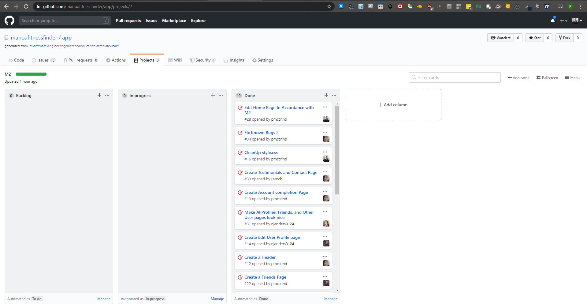

## Milestone 3

For this milestone we focused on usability and reliability and added in minor feature improvements to features that were already implemented in milestones 1 and 2. We added the feature to allow users to "subscribe" to their friends events. The event organizer can see the list of people who have stated that they are coming in the my events page. Lastly we worked on dynamic buttons such as if you are attending your friends event then you dont need to subscribe to the even twice. Similarly for the friends page if you already added a friend the add a friend button is not visible to you.

Milestone 3 was managed using <a href="https://github.com/manoafitnessfinder/app/projects/3">ManoaFitnessFinder GitHub Project Board M3</a>:

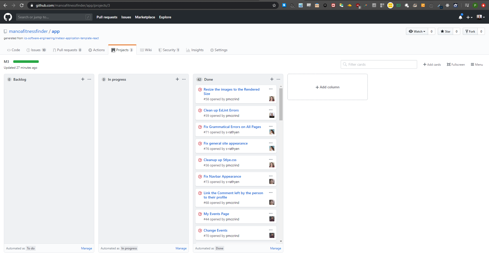

