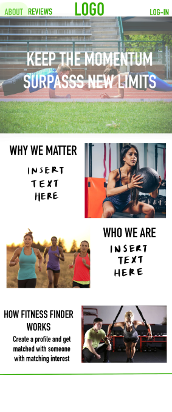
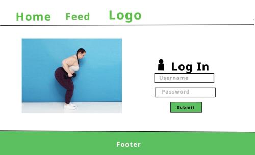
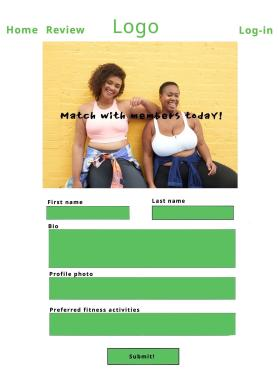
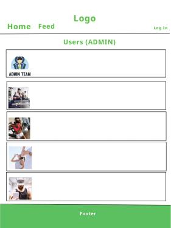

## Table of contents

* [Description](#description)
* [Team Members](#team-members)
* [User Guide](#user-guide)
* [Coming Soon](#coming-soon)

## Description

The problem: The freshman fifteen! So many students enter and go through college feeling too ashamed to go to the gym alone or feeling afraid to go on a run alone because of safety concerns.

The solution: The Fitness Finder application allows students to log in to the application and create a profile which specifies things like their gender, interests (e.g. strength training, running, outdoors), level (e.g. just starting, intermediate), “looking for” (e.g. a mentor to help me improve, a friend to keep me company while running, spotter/gym buddy), and goals (e.g. run an 8 minute mile, squat 200 lbs, hike Stairway to Heaven). The app would pair the user with someone with matching/similar interests.

Advanced implementation would also include the ability to document meetups (for safety or progress tracking), upload photos for each completed outing, and a feed where users can see the completed meetups/workouts their friends/matched users have done.

Notes on privacy and safety: Users can only sign up if they are current UH students. The website would also warn users when setting up a meeting with a matched user to meet in advance in a public place, like the gym. In the “Beyond the Basics” section I go into detail on a scheduling/progress tracking feature that would allow users to document every single meeting, which should deter other users with dubious intentions.

## Team Members
### Patrick McCrindle

I'm currently a Junior at UH Manoa studying Security Science. Having had no prior expierence with website design this class has been a whirlwind of new information. My interests for the this project is learning to implement basic website security and refining my knowledge of software engineering.

### Lucy Rock

I'm currently a Junior at UH Manoa, studying to get my BS in Computer Science. I am excited for this assignment because I have always had an interest in web design, and I can't wait to apply what I've learned in this class so far.

### Sophia Rathyen

Add description.

### Nathan Anderson

Website design is my passion. Growing up on my father's Javascript farm gave me a lifelong love of creating websites and an appreciation of the development skills required. It's become my dream to create the best Meteor app React designed intellij developed website for finding fitness partners in the Manoa area.

### Christine Uehara

I'm currently a Junior at UH Manoa, studying to get my BS in Computer Science. I have some experience in designing a website using a website developer, nothing like what we are learning in class. I am excited to take what I learned while working on this project and apply it to the website I am currently designing for work. 

## User Guide

Landing page 

Version #1

Version #2

#1

OR

#2

About page (Coming soon)

Login page (Coming soon)

Sign Up page (Coming soon)

Admin home page (Coming soon)

User home page (Coming soon)

User profile page (top part devoted to user profile - interests, level, etc; bottom part devoted to progress tracking – see “Beyond the basics” for more details)

Edit Profile (Coming soon)

Find users page (Coming soon)

Calender (Coming soon)

Contact user page which provides user’s info (email address, phone number, etc.) (accessible from “message” button on matched users page)

## Coming Soon

SCHEDULING PAGE - Users can schedule workouts: If the other user agrees, to a proposed match, they can use a scheduling page to create a new scheduled workout (date, time, place). This workout will be visible to ONLY the two users it concerns to protect their privacy.
PROGRESS TRACKING - Once the date/time passes for a scheduled workout, it will go into the user’s “progress” section of their profile – something like “(user1name) completed a 2.5 mile run with (user2name) on (date).” The user is then able to go in and edit the workout to add the time it was completed in, as well as add a picture that might have been taken on the run which they want to share. This will be posted to the friend feed if a “public” switch is toggled to on. Things like “place” can be toggled to “private” to protect the privacy of anyone who goes on recurring runs in the same place.

Progress tracking, ctd: Progress tracking would have an “overall” card displaying your first workout vs. your most recent workout. For example, “first recorded bench press: 100 lb” and beneath it “most recent PR: 200 lbs with (spotterusername)”.
FRIEND FEED PAGE - All public progress cards are displayed for friends and matched users (maybe a feed which includes everyone on site?)
Users can toggle match finding on/off if they find the perfect gym buddy, so they can instead use the site solely to record their progress.
