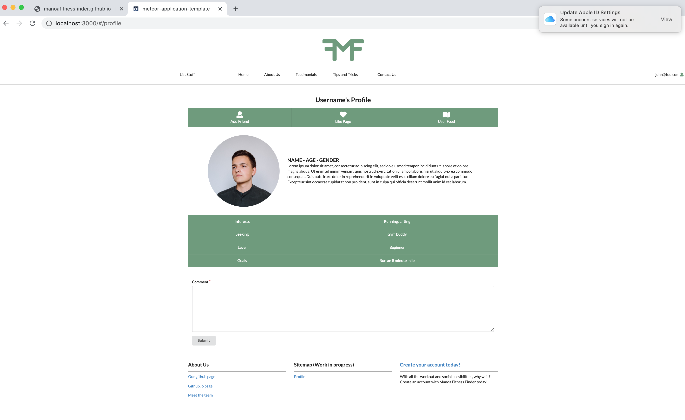

  

This website can be found at: 
[https://manoafitnessfinder.meteorapp.com](https://manoafitnessfinder.meteorapp.com)

 
The repository for this website can be found at: 
[https://github.com/manoafitnessfinder](https://github.com/manoafitnessfinder)

## Table of contents

* [Description](#description)
* [Team Members](#team-members)
* [User Guide](#user-guide)
* [Milestone 1](#milestone-1)
* [Milestone 2](#milestone-1)
* [Coming Soon](#coming-soon)

## Overview

The problem: The freshman fifteen! So many students enter and go through college feeling too ashamed to go to the gym alone or feeling afraid to go on a run alone because of safety concerns.

The solution: Manoa Fitness Finder allows students to log in and create a profile which allows them to set their: age, upload an image, a brief description, gender, interests (e.g. Running, Lifting, Acrobatics, Calisthenics, Walking, Hiking, and Climbing), level (e.g. beginner, intermediate, or advanced), seeking (e.g. Gym Buddy, Mentor, Mentee, or no Preference), and goals (e.g. run an 8 minute mile, squat 200 lbs, hike Stairway to Heaven). The app would pair the user with someone with matching/similar interests.

After creating a profile you can create an event that you are intending to go on and want others to join, or sign-up for an event that someone else has posted. You can add people to your friends list after browsing the list of other users. 

Advanced implementation would also include the ability to document meetups (for safety or progress tracking), upload photos for each completed outing, and a feed where users can see the completed meetups/workouts their friends/matched users have done.

Notes on privacy and safety: The website would also warn users when setting up a meeting with a matched user to meet in advance in a public place, like the gym.

## Team Members
### Patrick McCrindle

I'm currently a Junior at UH Manoa studying Security Science. Having had no prior expierence with website design this class has been a whirlwind of new information. My interests for the this project is learning to implement basic website security and refining my knowledge of software engineering.

### Lucy Rock

I'm currently a Junior at UH Manoa, studying to get my BS in Computer Science. I am excited for this assignment because I have always had an interest in web design, and I can't wait to apply what I've learned in this class so far.

### Sophia Rathyen

I'm a junior at UH Manoa double majoring in Computer Science and Russian. I have a passion for graphic design and art and hope to make use of some of those skills while designing this site. Along the way, I also hope to become adept in using Meteor and MongoDB. I'm looking forward to merging my interest in fitness and software engineering to create a useful, beneficial website for other students.

### Nathan Anderson

Website design is my passion. Growing up on my father's Javascript farm gave me a lifelong love of creating websites and an appreciation of the development skills required. It's become my dream to create the best Meteor app React designed intellij developed website for finding fitness partners in the Manoa area.

### Christine Uehara

I'm currently a Junior at UH Manoa, studying to get my BS in Computer Science. I have some experience in designing websites using a website developer, nothing like what we are learning in class. I am excited to take what I learned while working on this project and apply it to the website I am currently designing for work. 

## Galaxy Deployment

View our current website at <a href="http://manoafitnessfinder.meteorapp.com/#/">Manoa Fitness Finder</a>.

## User Guide

### Landing page 
[http://manoafitnessfinder.meteorapp.com/#/](http://manoafitnessfinder.meteorapp.com/#/) 
This is the user's introduction to Manoa Fitness Finder. 

### About page
[http://manoafitnessfinder.meteorapp.com/#/about](http://manoafitnessfinder.meteorapp.com/#/about) 
This page presents basic information about the purpose and vision of our app. 

### Login page
[http://manoafitnessfinder.meteorapp.com/#/signin](http://manoafitnessfinder.meteorapp.com/#/signin) 
All links that contain "Login" lead here. Users can access their account specific feed pages and profile information once logged in.

### Sign Up page
[http://manoafitnessfinder.meteorapp.com/#/signup](http://manoafitnessfinder.meteorapp.com/#/signup) 
Allows new users to create accounts on Manoa Fitness Finder. Also prompts for basic user information which will contribute to their account. 

### User profile page
[http://manoafitnessfinder.meteorapp.com/#/profile](http://manoafitnessfinder.meteorapp.com/#/profile) 
Displays the users current information as other people on the website would view them. Contains a link to edit their information.

<b>Notes:</b> 
* Later, will possibly add a "progress tracking" feature on the bottom part of page 
* Add an "add as friend" feature  

### All Users Page
[http://manoafitnessfinder.meteorapp.com/#/AllProfiles](http://manoafitnessfinder.meteorapp.com/#/AllProfiles) 
This page lists all users on the site, allowing you to filter based on age, interests, fitness level, and seeking status.

### Events
[http://manoafitnessfinder.meteorapp.com/#/schedule](http://manoafitnessfinder.meteorapp.com/#/schedule) 
Here you'll be able to view events that you and your friends have created.

### Another User
This is the page to view another User's profile. There will be key features missing such as the edit profile button.

### Friends Page
[http://manoafitnessfinder.meteorapp.com/#/friends](http://manoafitnessfinder.meteorapp.com/#/friends) 
Lists all of the profiles you have added to your friends list.

## Milestone 1

<a href="https://github.com/manoafitnessfinder/app/projects/1">MileStone 1</a>

## Milestone 2

<a href="https://github.com/manoafitnessfinder/app/projects/2">MileStone 2</a>

## Milestone 3

<a href="https://github.com/manoafitnessfinder/app/projects/3">MileStone 3</a>

## Coming Soon

### Admin home page
Description is a work in progress as feature-set hasn't been decided on. All users visible and certain administrative actions can be taken from this page.

### User home page
Work in progress
This is what the user will see after they log-in to their account. 

### Match/Find users page
A page that filters other profiles visible to the user based on the users preferences. This page looks to match Mentors/Mentees,<!--is Mentee a word? Like, I'm sure it is but it just doesn't feel right.--> gym partners of equal level, and workout interests.

### Schedule/Calendar page
Allows logged in users to see their matches schedules and post their workouts. Can switch between calendar view and events view.

Users can schedule workouts: If the other user agrees, to a proposed match, they can use a scheduling page to create a new scheduled workout (date, time, place). This workout will be visible to ONLY the two users it concerns to protect their privacy.  

### Edit Profile

User will be able edit their profile. Including interests, picture, first and last name.

## Potential Features

### Progress Tracking

Once the date/time passes for a scheduled workout, it will go into the user’s “progress” section of their profile – something like “(user1name) completed a 2.5 mile run with (user2name) on (date).” The user is then able to go in and edit the workout to add the time it was completed in, as well as add a picture that might have been taken on the run which they want to share. This will be posted to the friend feed if a “public” switch is toggled to on. Things like “place” can be toggled to “private” to protect the privacy of anyone who goes on recurring runs in the same place. 
Progress tracking, ctd: Progress tracking would have an “overall” card displaying your first workout vs. your most recent workout. For example, “first recorded bench press: 100 lb” and beneath it “most recent PR: 200 lbs with (spotterusername)”.  

### Friend Feed Page

All public progress cards are displayed for friends and matched users (maybe a feed which includes everyone on site?)  
Users can toggle match finding on/off if they find the perfect gym buddy, so they can instead use the site solely to record their progress.  
